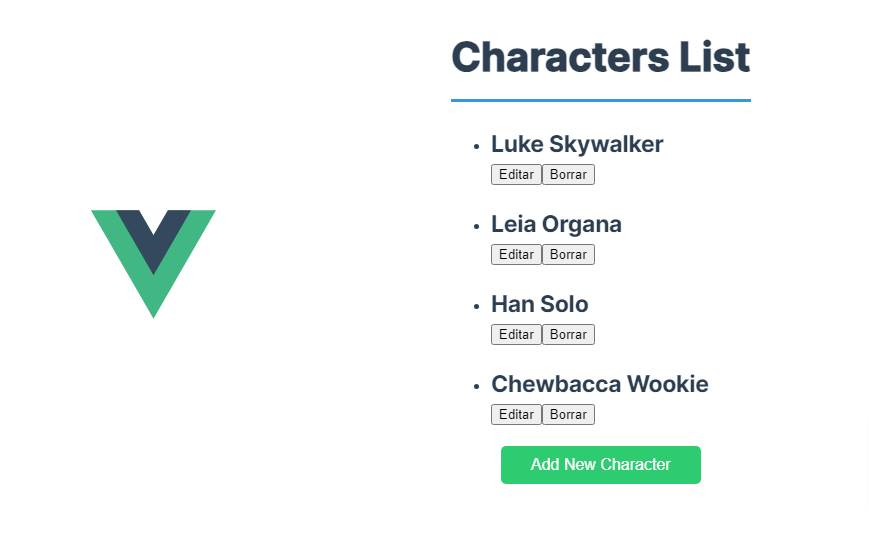

# 🦸‍♂️ Vue Character Management App

## 📸 Captura de la Aplicación

<p align="center">
  
</p>

## 📝 Descripción del Proyecto

🚀 Aplicación web desarrollada con Vue 3 que permite gestionar personajes.

## ✨ Características Principales

- 🖥️ Desarrollado con Vue 3 (con Composition API) y TypeScript
- 🗃️ Gestión de estado con Pinia
- 🛣️ Enrutamiento con Vue Router
- ✅ Validación de formularios con Zod
- 🌐 Peticiones HTTP simuladas con Axios y Axios Mock Adapter
- 🎨 Estilizado con Sass
- ⚡ Vite como herramienta de construcción
- 🧹 ESLint, Prettier y Oxlint para mantener el código limpio y consistente

## 🏗️ Estructura del Proyecto

La aplicación consta de las siguientes funcionalidades principales:

- 🔐 Login y Registro de la app
- 📋 Lista de personajes
- ➕ Formulario para añadir nuevos personajes
- ✏️ Edición de personajes existentes
- 🗑️ Eliminar personajes existentes
- 🛡️ Validación de formularios

## 🚀 Configuración y Ejecución

Para ejecutar el proyecto localmente:

1. 📥 Clona el repositorio
2. 📦 Instala las dependencias con `npm install`
3. 🏃‍♂️ Ejecuta el servidor de desarrollo con `npm run dev`
4. 🌐 Accede a `http://localhost:5173` en tu navegador

Para construir el proyecto para producción:

```
npm run build
```

## 📄 Licencia

Este proyecto está bajo la [Licencia MIT](LICENSE). Puedes ver los detalles completos en el archivo [LICENSE](LICENSE).
